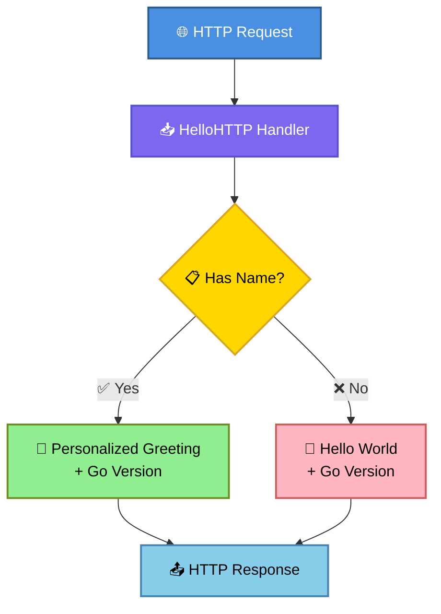
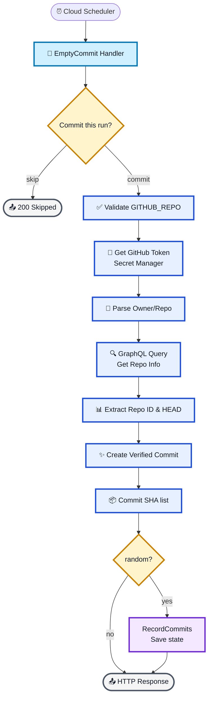
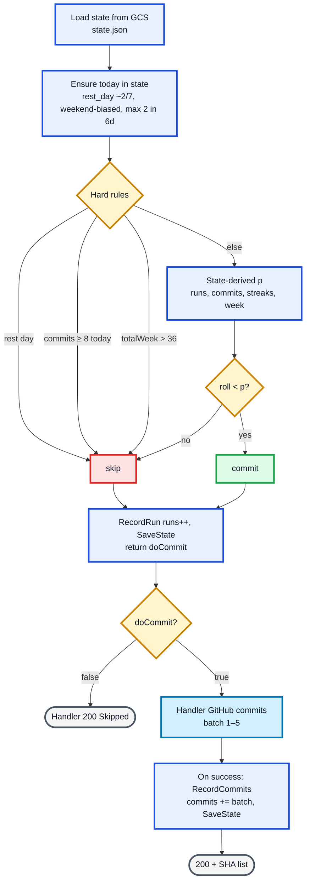

# Cloud Functions

This directory contains the source code for all Cloud Functions deployed in this project.

## Functions

### Hello World Function

A simple HTTP Cloud Function that demonstrates basic functionality. It accepts an optional JSON payload with a `name` field and returns a greeting message along with the Go runtime version.

**Description**: Returns a personalized greeting or default "Hello, World!" message with Go version information.


```mermaid
graph TB
    A[🌐 HTTP Request] --> B[📥 HelloHTTP Handler]
    B --> C{📋 Has Name?}
    C -->|✅ Yes| D[💬 Personalized Greeting<br/>+ Go Version]
    C -->|❌ No| E[👋 Hello World<br/>+ Go Version]
    D --> F[📤 HTTP Response]
    E --> F
    
    style A fill:#4A90E2,stroke:#2E5C8A,stroke-width:2px,color:#fff
    style B fill:#7B68EE,stroke:#5A4FCF,stroke-width:2px,color:#fff
    style C fill:#FFD700,stroke:#DAA520,stroke-width:2px,color:#000
    style D fill:#90EE90,stroke:#6B8E23,stroke-width:2px,color:#000
    style E fill:#FFB6C1,stroke:#CD5C5C,stroke-width:2px,color:#000
    style F fill:#87CEEB,stroke:#4682B4,stroke-width:2px,color:#000
```

**Flow**:
1. Receives HTTP request (GET or POST with JSON body)
2. Attempts to decode JSON body into `request` struct
3. If decoding fails, returns 400 error
4. If `name` is empty, returns "Hello, World!" with Go version
5. If `name` is provided, returns personalized greeting with escaped HTML and Go version

**Entry Point**: `HelloHTTP`

**Source**: `hello_world/hello.go`

---

### GitHub Scheduler Function

Creates verified empty commits to a GitHub repository using the GitHub GraphQL API. The function is triggered by Cloud Scheduler and automatically signs commits, making them appear as "Verified" in GitHub.

**Description**: Automatically creates verified empty commits to maintain repository activity. Uses GitHub's GraphQL API to ensure commits are properly signed and verified.

**Modes** (set via `COMMIT_MODE`):

| Mode | Schedule | Behavior |
|------|----------|----------|
| `scheduled` (default) | Once daily at 00:00 UTC | Always performs a commit when invoked |
| `random` | 4× daily at 00:00, 06:00, 12:00, 18:00 UTC | State-driven: loads prior runs/commits from GCS. Rest days (~2/7) with a weekend bias (Sat/Sun more likely), 8/day cap, and heavy-week skip are hard rules; otherwise a state-derived probability uses runs/commits today, recent streaks, and last-7-days total (with a late-day boost). Heavy days can batch 2–5 commits per run. No `COMMIT_PROBABILITY`; state is the gate. Requires `GIT_COMMIT_STATE_BUCKET`. |


```mermaid
flowchart TD
    A([⏰ Cloud Scheduler]) --> B[🚀 EmptyCommit Handler]

    B --> C{Commit this run?}
    C -->|skip| D([📤 200 Skipped])
    C -->|commit| E[✅ Validate GITHUB_REPO]

    E --> F[🔐 Get GitHub Token<br/>Secret Manager]
    F --> G[📝 Parse Owner/Repo]
    G --> H[🔍 GraphQL Query<br/>Get Repo Info]
    H --> I[📊 Extract Repo ID & HEAD]
    I --> J[✨ Create Verified Commit]
    J --> K[📦 Commit SHA list]
    K --> U{random?}
    U -->|yes| V[RecordCommits<br/>Save state]
    U -->|no| L([📤 HTTP Response])
    V --> L

    classDef core fill:#D0F0FF,stroke:#0077B6,stroke-width:3px,color:#111827;
    classDef decision fill:#FFF4CC,stroke:#C98100,stroke-width:3px,color:#111827;
    classDef io fill:#F5F5F5,stroke:#4B5563,stroke-width:3px,color:#111827;
    classDef step fill:#E7F0FF,stroke:#1D4ED8,stroke-width:3px,color:#111827;
    classDef git fill:#F3E8FF,stroke:#6D28D9,stroke-width:3px,color:#111827;

    class B core;
    class C,U decision;
    class D,L io;
    class E,F,G,H,I,J,K step;
    class V git;
```

---

### Random mode: state flow

Detail for the "Random: state flow" and "Commit this run?" steps in the diagram above.


```mermaid
flowchart TD
    R1[Load state from GCS<br/>state.json] --> R2[Ensure today in state<br/>rest_day ~2/7, weekend‑biased, max 2 in 6d]
    R2 --> R3{Hard rules}

    R3 -->|rest day| S1[skip]
    R3 -->|commits ≥ 8 today| S1
    R3 -->|totalWeek &gt; 36| S1
    R3 -->|else| R4[State-derived p<br/>runs, commits, streaks, week]

    R4 --> R5{roll &lt; p?}
    R5 -->|no| S1
    R5 -->|yes| S2[commit]

    S1 --> R6[RecordRun runs++, SaveState<br/>return doCommit]
    S2 --> R6

    R6 --> R7{doCommit?}
    R7 -->|false| R8([Handler 200 Skipped])
    R7 -->|true| R9[Handler GitHub commits<br/>batch 1–5]
    R9 --> R10[On success: RecordCommits<br/>commits += batch, SaveState]
    R10 --> R11([200 + SHA list])

    classDef decision fill:#FFF4CC,stroke:#C98100,stroke-width:3px,color:#111827;
    classDef io fill:#F5F5F5,stroke:#4B5563,stroke-width:3px,color:#111827;
    classDef step fill:#E7F0FF,stroke:#1D4ED8,stroke-width:3px,color:#111827;
    classDef action fill:#D0F0FF,stroke:#0077B6,stroke-width:3px,color:#111827;
    classDef skip fill:#FEE2E2,stroke:#DC2626,stroke-width:3px,color:#111827;
    classDef commit fill:#DCFCE7,stroke:#16A34A,stroke-width:3px,color:#111827;

    class R3,R5,R7 decision;
    class R8,R11 io;
    class R1,R2,R4,R6,R10 step;
    class R9 action;
    class S1 skip;
    class S2 commit;
```

**Flow**:
1. **Mode check** (random only): Load state from GCS (`GIT_COMMIT_STATE_BUCKET`), ensure today (rest_day ~2/7 for new days with weekend bias). `ShouldCommit` uses only state: hard rules (rest day, 8/day cap, heavy week) and a state-derived probability with streak/late‑day boosts when none apply. Record run; on skip, save state and return 200.
2. **Validation**: Validates `GITHUB_REPO` environment variable format (must be `owner/repo`)
3. **Secret Retrieval**: Fetches GitHub token from GCP Secret Manager using `PROJECT_ID` environment variable
4. **Repository Lookup**: Uses GraphQL API to get repository ID and current HEAD commit SHA
5. **Commit Creation**: Uses GraphQL `createCommitOnBranch` mutation to create an empty commit
   - Reuses the current tree SHA (no file changes)
   - Creates commit with timestamped message
   - GitHub automatically signs commits created via API
6. **State update** (random only): After successful commit(s), increment today’s commit count by the number created and save.
7. **Response**: Returns the commit SHA(s) on success

**Key Components**:
- **state.go**: GCS load/save, state-driven `ShouldCommit` (hard rules + state-derived probability), `CommitBatchSize`, `RecordRun` / `RecordCommits`
- **secrets.go**: Secret Manager integration
- **graphql.go**: GraphQL API client for GitHub operations
- **validation.go**: Repository format validation
- **types.go**: Type definitions for GraphQL responses

**Entry Point**: `EmptyCommit`

**Environment Variables**:
- `GITHUB_REPO`: Repository in format `owner/repo` (e.g., `ahummel25/github-scheduler`)
- `PROJECT_ID`: GCP project ID for Secret Manager access
- `COMMIT_MODE`: `scheduled` (default) or `random`
- `GIT_COMMIT_STATE_BUCKET`: (random only) Dedicated GCS bucket (e.g. `{project_id}-git-commit-state`) for `state.json` (runs, commits, rest_day per day). Required in `random` mode; separate from the functions zip bucket.

**Dependencies**:
- `cloud.google.com/go/secretmanager` and `secretmanagerpb`: Secret Manager
- `cloud.google.com/go/storage`: GCS for state (random mode)
- `github.com/GoogleCloudPlatform/functions-framework-go`: Functions framework

**Source**: `git_commit/`

## Function Structure

Each function directory contains:
- Go source files (`.go`)
- `go.mod`: Go module definition
- `go.sum`: Dependency checksums
- `function.zip`: Compiled archive (generated by Terraform)

## Development

### Local Testing

Functions can be tested locally using the Functions Framework:

```bash
cd functions/git_commit
go run git_commit.go
```

### Building

Functions are automatically built and archived by Terraform during deployment. The `archive_file` data source creates the zip file from the source directory.

### Adding New Functions

1. Create a new directory in `functions/`
2. Implement your function following the Functions Framework pattern
3. Add `go.mod` with required dependencies
4. Reference the function in `infra/environments/prod/main.tf` using the `cloud-function` module

