# Cloud Functions

This directory contains the source code for all Cloud Functions deployed in this project.

## Functions

### Hello World Function

A simple HTTP Cloud Function that demonstrates basic functionality. It accepts an optional JSON payload with a `name` field and returns a greeting message along with the Go runtime version.

**Description**: Returns a personalized greeting or default "Hello, World!" message with Go version information.

```mermaid
graph TB
    A[🌐 HTTP Request] --> B[📥 HelloHTTP Handler]
    B --> C{📋 Has Name?}
    C -->|✅ Yes| D[💬 Personalized Greeting<br/>+ Go Version]
    C -->|❌ No| E[👋 Hello World<br/>+ Go Version]
    D --> F[📤 HTTP Response]
    E --> F
    
    style A fill:#4A90E2,stroke:#2E5C8A,stroke-width:2px,color:#fff
    style B fill:#7B68EE,stroke:#5A4FCF,stroke-width:2px,color:#fff
    style C fill:#FFD700,stroke:#DAA520,stroke-width:2px,color:#000
    style D fill:#90EE90,stroke:#6B8E23,stroke-width:2px,color:#000
    style E fill:#FFB6C1,stroke:#CD5C5C,stroke-width:2px,color:#000
    style F fill:#87CEEB,stroke:#4682B4,stroke-width:2px,color:#000
```



**Flow**:
1. Receives HTTP request (GET or POST with JSON body)
2. Attempts to decode JSON body into `request` struct
3. If decoding fails, returns 400 error
4. If `name` is empty, returns "Hello, World!" with Go version
5. If `name` is provided, returns personalized greeting with escaped HTML and Go version

**Entry Point**: `HelloHTTP`

**Source**: `hello_world/hello.go`

---

### GitHub Scheduler Function

Creates verified empty commits to a GitHub repository using the GitHub GraphQL API. The function is triggered by Cloud Scheduler and automatically signs commits, making them appear as "Verified" in GitHub.

**Description**: Automatically creates verified empty commits to maintain repository activity. Uses GitHub's GraphQL API to ensure commits are properly signed and verified.

```mermaid
graph TD
    A[⏰ Cloud Scheduler<br/>Daily @ UTC] --> B[🚀 EmptyCommit Handler]
    
    B --> C[✅ Validate GITHUB_REPO]
    B --> D[🔐 Get GitHub Token<br/>Secret Manager]
    
    C --> E[📝 Parse Owner/Repo]
    D --> E
    
    E --> F[🔍 GraphQL Query<br/>Get Repository Info]
    F --> G[📊 Extract Repo ID & HEAD SHA]
    G --> H[✨ GraphQL Mutation<br/>Create Verified Commit]
    H --> I[📦 Return Commit SHA]
    I --> J[📤 HTTP Response]
    
    style A fill:#FF6B6B,stroke:#C92A2A,stroke-width:3px,color:#fff
    style B fill:#4ECDC4,stroke:#2D9CDB,stroke-width:3px,color:#fff
    style C fill:#FFE66D,stroke:#F39C12,stroke-width:2px,color:#000
    style D fill:#A8E6CF,stroke:#27AE60,stroke-width:3px,color:#000
    style E fill:#FFD3A5,stroke:#E67E22,stroke-width:2px,color:#000
    style F fill:#C7CEEA,stroke:#6C5CE7,stroke-width:3px,color:#000
    style G fill:#FFB6C1,stroke:#E84393,stroke-width:2px,color:#000
    style H fill:#95E1D3,stroke:#00B894,stroke-width:4px,color:#000
    style I fill:#FDCB6E,stroke:#F39C12,stroke-width:2px,color:#000
    style J fill:#74B9FF,stroke:#0984E3,stroke-width:3px,color:#fff
```



**Flow**:
1. **Validation**: Validates `GITHUB_REPO` environment variable format (must be `owner/repo`)
2. **Secret Retrieval**: Fetches GitHub token from GCP Secret Manager using `PROJECT_ID` environment variable
3. **Repository Lookup**: Uses GraphQL API to get repository ID and current HEAD commit SHA
4. **Commit Creation**: Uses GraphQL `createCommitOnBranch` mutation to create an empty commit
   - Reuses the current tree SHA (no file changes)
   - Creates commit with timestamped message
   - GitHub automatically signs commits created via API
5. **Response**: Returns the commit SHA on success

**Key Components**:
- **secrets.go**: Handles Secret Manager integration
- **graphql.go**: GraphQL API client for GitHub operations
- **validation.go**: Repository format validation
- **types.go**: Type definitions for GraphQL responses

**Entry Point**: `EmptyCommit`

**Environment Variables**:
- `GITHUB_REPO`: Repository in format `owner/repo` (e.g., `ahummel25/github-scheduler`)
- `PROJECT_ID`: GCP project ID for Secret Manager access

**Dependencies**:
- `cloud.google.com/go/secretmanager/apiv1`: Secret Manager client
- `cloud.google.com/go/secretmanager/apiv1/secretmanagerpb`: Secret Manager types
- `github.com/GoogleCloudPlatform/functions-framework-go`: Functions framework

**Source**: `git_commit/`

## Function Structure

Each function directory contains:
- Go source files (`.go`)
- `go.mod`: Go module definition
- `go.sum`: Dependency checksums
- `function.zip`: Compiled archive (generated by Terraform)

## Development

### Local Testing

Functions can be tested locally using the Functions Framework:

```bash
cd functions/git_commit
go run git_commit.go
```

### Building

Functions are automatically built and archived by Terraform during deployment. The `archive_file` data source creates the zip file from the source directory.

### Adding New Functions

1. Create a new directory in `functions/`
2. Implement your function following the Functions Framework pattern
3. Add `go.mod` with required dependencies
4. Reference the function in `infra/environments/prod/main.tf` using the `cloud-function` module

